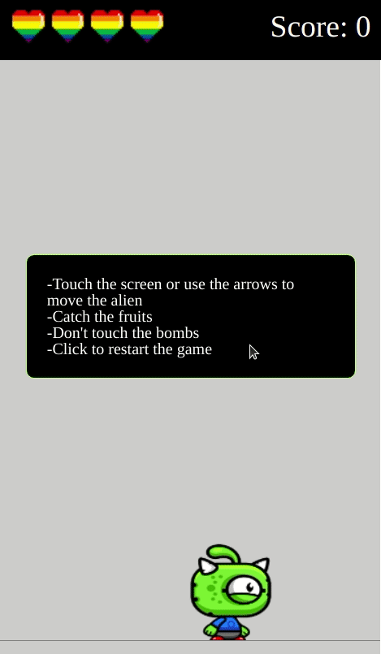

# Fruit game 🎮
A simple game build with object oriented programming 🥝
## Preview 👀
 

## About 🔎
This is an web game wich you can catch fruits to get points and avoid bombs to keep playing.
### Implemented features :heavy_check_mark:
- [x] Initial score
- [x] Drop fruits
- [x] Player motion
### Future improvements 🔮
- [ ] Increase score
- [ ] Drop bombs
## Tech tools 🔧
The following tools and frameworks were used in the construction of the project:<br>
<p>
  
  
  
</p>

## How to run ⚙️

1. Clone this repository
2. Install dependencies
```bash
npm i
```
3. Build the bundle
```bash
npx webback
```
4. Finally double click in the index file to play 
